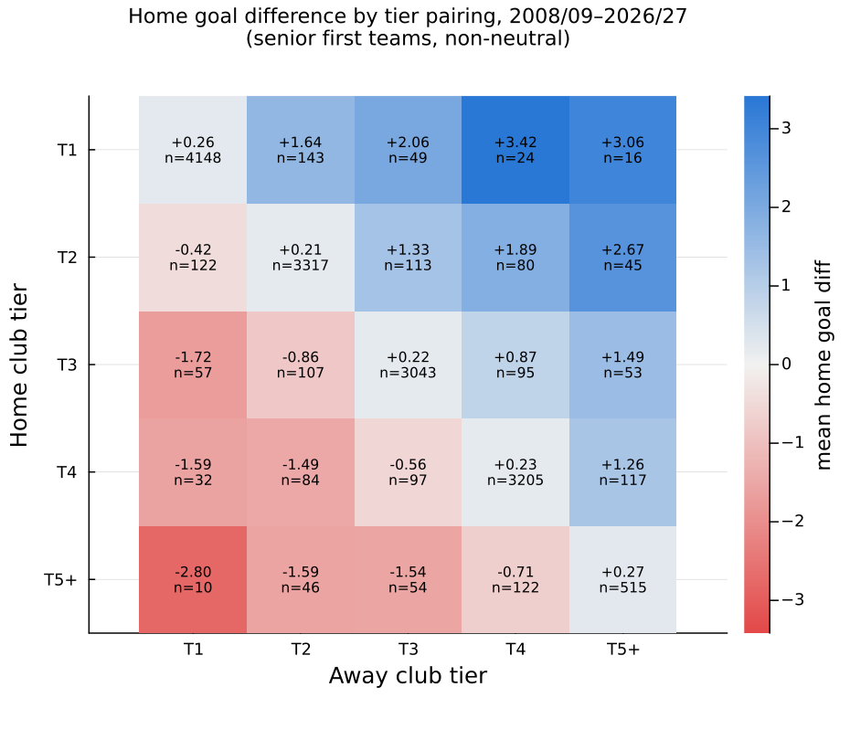
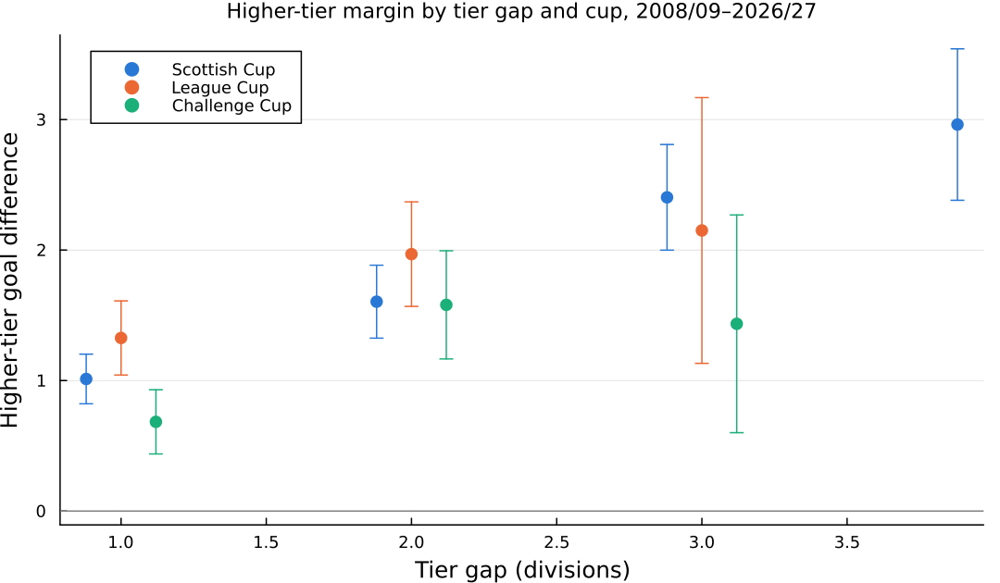
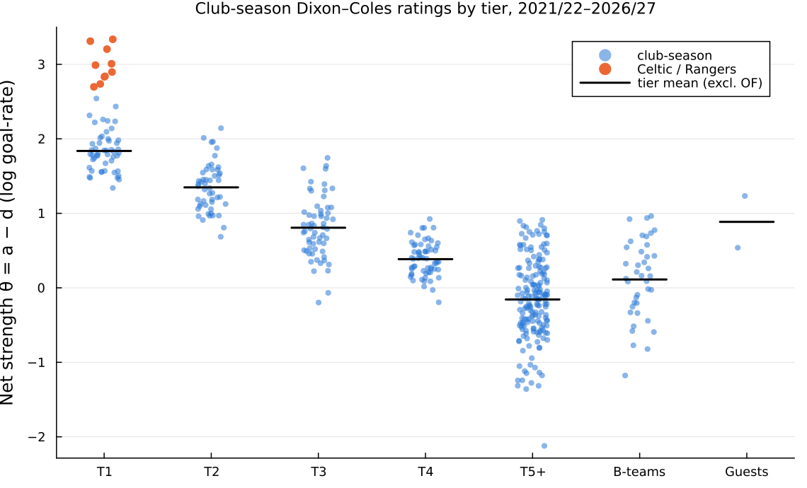
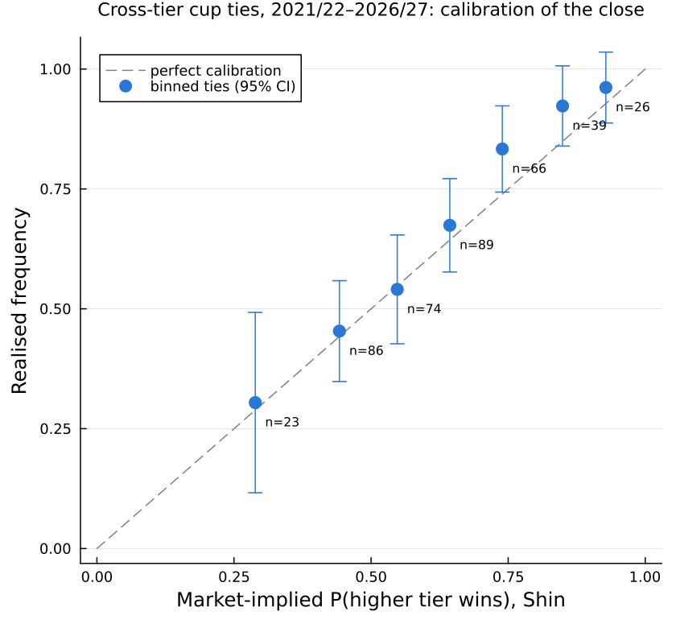

# Scottish pyramid & cross-tier cup EDA (TODO 029)

**Question.** Now that betdb holds the three Scottish cups, how far apart are the tiers of the
Scottish pyramid, is the gap between tiers uniform, does the closing market price cross-tier
cup ties correctly, and what priors should the TODO 028 cross-tier models use?

**Tracking:** [`todos/029`](../../../todos/029_cross_tier_scottish_cup_and_pyramid_hierarchy_eda.md) ·
**Feeds:** [`todos/028`](../../../todos/028_cross_tier_scottish_pyramid_and_informative_priors_time_decay_models.md) ·
**Predecessor:** [`scottish_lower/13_pedigree_fulltime_and_tier_priors_eda`](../../scottish_lower/13_pedigree_fulltime_and_tier_priors_eda/README.md) (TODO 027, `f82599e1`)

All numbers below come from the generated tables in `results/`, which you can regenerate with
`include("…/run_all.jl")` (≈ 3 min in a warm REPL). Units are **log goal-rate** on the scale the L1
engines use (`log λ_home = int + γ + α_home + β_away`; α = attack, β = concession, net θ = α − β).

---

## 1. Executive summary

1. **The Scottish pyramid is linear once Celtic and Rangers are treated as clubs, not as a tier.**
   Across 2021/22–2026/27 the tier steps are T1→T2 **0.51 ± 0.12**, T2→T3 **0.48 ± 0.11**,
   T3→T4 **0.44 ± 0.11** and T4→non-league **0.44 ± 0.10**. The Wald test of equal steps gives
   χ²₂ = 0.16 (**p = 0.92**). A single pooled step of **0.47 ± 0.04** means an average club
   out-scores an average club one division lower by a rate ratio of about 1.6 at a neutral venue.
2. **The apparent Premiership "chasm" is the Old Firm.** With Celtic and Rangers pooled into T1
   the first step is 0.80, and linearity is marginal (p = 0.066). The Old Firm sit **1.15 ± 0.08**
   above the rest of the Premiership, which is more than two whole tier steps. They belong in
   team effects. Folding them into τ₁ would over-state the gap for the other ten clubs by about 60%.
3. **The pyramid's shape changes over time.** Before 2020 the Premiership-minus-Old-Firm stood only
   about 0.18 above the Championship, which then held Hearts, Hibs, Dundee United and others, and
   the Championship→League One drop was about 0.70. The long-window (2008–26) linearity test rejects
   (p = 0.011), but that rejection comes from the era change. For the current models, the
   post-2020 structure is the relevant one.
4. **Goal levels are flat across the SPFL.** The tier scoring offsets g_T are within ±0.06 of the
   Premiership. Only non-league ties are higher-scoring (+0.18 to +0.22). In A1, δ_league can be
   close to zero.
5. **The closing market prices the goal margin of cross-tier cup ties correctly.** Realised minus
   implied supremacy is **+0.04 ± 0.09 goals** (N = 403) and the Mincer–Zarnowitz slope is
   **0.95 ± 0.09**. Neither a walk-forward tier-only GLM nor a walk-forward Dixon–Coles network
   carries information beyond the close (encompassing coefficients −0.03 and −0.03, p > 0.8). Both
   score worse on log-loss (0.855 vs **0.798**).
6. **The market does show a favourite–longshot bias in these ties, and it is steeper than in the
   league.** Selections priced under 15% win 5.5% of the time against 8.7% implied (ROI −52%, league
   −23%). Favourites priced above 60% (almost always the higher-tier club) beat their implied probability by about 6 points
   (ROI +2.6% ± 4% after a 10% overround, league −4%). The draw is over-priced (16.1% realised vs
   19.4% implied). Direction: the market over-prices lower-division underdogs and the draw in
   mismatches. The favourite edge is consistent across bands but not statistically significant.
7. **The Challenge Cup compresses margins.** At equal tier gap and venue, higher-tier clubs win
   Challenge Cup ties by **0.31 ± 0.13** fewer goals than Scottish Cup ties (2008–26, p = 0.016). The
   primary window shows the same sign (−0.15, not significant). B-teams play at tier-4/5 level:
   T4 clubs beat them by +0.68, and T5 clubs lose to them by −0.29.
8. **Relegated clubs carry about +0.28 of net strength into their new tier, not +0.90.** A club
   relegated into League One rates **α +0.12 (σ₀ 0.20), β −0.16 (σ₀ 0.26)** against that tier's
   stayers (net +0.28; structural evidence from 26 transitions, market evidence from the first five
   games). As an α offset, +0.90 is 9 standard errors from the mean. Even read as net θ, only 3% of
   relegated clubs reach it. +0.65 and +0.75 are also rejected. Clubs relegated into League Two
   carry almost nothing (+0.07).
9. **Recommended priors (details in §7).** Option A2: each SPFL step **d_j ~ TruncatedNormal(0.47,
   0.16; 0, ∞)**, with 48% applied to α and 52% to β; Celtic and Rangers stay out of the tier offset.
   Option B1 into League One: **α₀ ~ N(+0.12, 0.20²), β₀ ~ N(−0.16, 0.26²)**. The σ₀ matters:
   Ross County 2026/27, a double relegation, is priced by the close at θ +1.09. That is 2.5σ₀ above
   the structural mean, so combine B1 with the market-derived B2 or a wealth covariate rather than
   tightening σ₀.

---

## 2. Data provenance

Source: betdb `sofascore.events` (the full fixture universe; `sofascore.matches` is a narrower
enrichment table), finished matches with a normal-time score. AET and penalty ties are scored at
90 minutes, walkovers and awarded games are dropped, and the window ends 2026-09-23.
Enrichment:
- **BBC shots and shots on target:** `bbc.match_stats`, with imputed `filled` rows set to missing.
- **BBC commentary proxy xG:** the TODO 027 / `Features.parse_shot` empirical-Bayes cell model,
  refitted on all 57,045 parsed open-play shots in this panel so that cup and league pxG share one
  scale.
- **SofaScore closing 1X2:** `match_odds` "Full time", the last pre-match fractional price. It is
  the only source that covers the Challenge Cup.
- **Betfair:** last coherent pre-kick-off MATCH_ODDS snapshot. There are **no verified Betfair
  archives for any cup tie**, so the planned Betfair robustness check has N = 0.

The **primary window** is 2021/22–2026/27, and every enrichment-based result uses it. A **long window**
2008/09–2026/27 (goals only) adds power to the tier-step GLMs and to the transition study.

<!-- results/r01_sample_breakdown.md (primary rows) -->
| window | tournament | competition | matches | seasons | senior cross-tier | with B-team | with guest | with T5 | neutral | AET/pens | BBC shots | pxG | SofaScore 1X2 | Betfair 1X2 |
|---|---|---|---|---|---|---|---|---|---|---|---|---|---|---|
| primary | 54 | Premiership | 1032 | 21/22–26/27 | 0 | 0 | 0 | 0 | 0 | 0 | 1003 | 607 | 1028 | 956 |
| primary | 55 | Championship | 925 | 21/22–26/27 | 0 | 0 | 0 | 0 | 0 | 0 | 855 | 545 | 924 | 479 |
| primary | 56 | League One | 933 | 21/22–26/27 | 0 | 0 | 0 | 0 | 0 | 0 | 907 | 553 | 932 | 840 |
| primary | 57 | League Two | 933 | 21/22–26/27 | 0 | 0 | 0 | 0 | 0 | 0 | 905 | 553 | 933 | 699 |
| primary | 73 | Scottish Cup | 520 | 21/22–25/26 | 230 | 0 | 0 | 336 | 17 | 72 | 354 | 182 | 365 | 0 |
| primary | 982 | League Cup | 87 | 21/22–26/27 | 35 | 0 | 0 | 0 | 16 | 13 | 85 | 57 | 84 | 0 |
| primary | 1520 | Challenge Cup | 368 | 21/22–26/27 | 146 | 171 | 13 | 101 | 5 | 38 | 359 | 248 | 366 | 0 |
| long | all 7 | — | 16,119 | 08/09–26/27 | 1,494 | 249 | 60 | 1,048 | 127 | 246 | — | — | — | — |

The primary window has **4,798 fixtures**, of which **411 are senior cross-tier ties**. The ~979
figure in the work package counted every cup match: 381 cup ties are same-tier (232 of them non-league
vs non-league in the early Scottish Cup rounds) and 183 involve a B-team or a guest.
**betdb holds only the League Cup knockout rounds** (15 ties per season); the July group stage is
absent, so League Cup cross-tier evidence is thin (35 ties in the primary window, 306 in the long one).

### Tier assignment and the cup nuances (`r01`)
- **Point-in-time tier.** A club's tier in a football season (July–June) is the SPFL league it is
  *scheduled* in that season. Fixtures in any status count, so a relegated club already carries its
  new tier in its first July cup tie. The assignment is unique for every club-season (asserted).
- **T5+** covers every Scottish senior club outside the SPFL that season: Highland, Lowland,
  East/West of Scotland and junior sides. A heuristic T5a/T6+ split (ex-SPFL or Challenge Cup
  invitee vs the rest) is kept as a sensitivity only. It mislabels Highland League sides that never
  received a Challenge Cup invitation (Forres, Huntly, Keith, Rothes), so T5 stays pooled.
- **B-teams / U20 / U21** (Celtic B, Rangers B, Aberdeen B, Hearts B, …; 38 sides) come from
  SofaScore's `parentTeam` link or an anchored slug suffix. They form their own category and never
  receive a senior tier. Real clubs with "Colts"/"Academy" in the name (Cumbernauld Colts, Wick
  Academy, Edusport Academy, Hamilton Academical) are not caught.
- **Guests** (The New Saints, Connah's Quay, Crusaders, Linfield, Bohemians, Wrexham, Sutton, …; 18
  clubs) are clubs from outside the Scottish association. Berwick Rangers is English-based but plays
  in the Scottish pyramid, so it is treated as a senior Scottish club.
- **Neutral venues:** Scottish Cup and League Cup semi-finals and finals, the Challenge Cup final,
  and any other cup tie BBC places at Hampden (except Queen's Park home games). Full audit:
  `results/r01_category_audit.csv`.

---

## 3. Empirical supremacy matrices (`r02`)

**ΔTier matrix**, home perspective (ΔTier = Tier_away − Tier_home; +k means the home club is k
divisions higher). Primary window, senior first teams, non-neutral:

| ΔTier | N | Home % | Draw % | Away % | mean GD | total goals | ΔShots | ΔSoT | n pxG | ΔpxG | mkt home % |
|---|---|---|---|---|---|---|---|---|---|---|---|
| −4 | 4 | 25.0 | 0.0 | 75.0 | −2.25 | 3.25 | −9.75 | −3.25 | 2 | −1.24 | 6.0 |
| −3 | 24 | 12.5 | 8.3 | 79.2 | −1.71 | 2.88 | −9.00 | −4.25 | 16 | −1.68 | 12.4 |
| −2 | 42 | 19.0 | 9.5 | 71.4 | −1.52 | 3.24 | −7.00 | −3.70 | 29 | −1.38 | 17.0 |
| −1 | 129 | 25.6 | 25.6 | 48.8 | −0.55 | 2.86 | −2.01 | −1.29 | 83 | −0.54 | 27.5 |
| 0 | 4173 | 42.8 | 25.4 | 31.9 | +0.25 | 2.76 | +1.44 | +0.57 | 2340 | +0.25 | 42.2 |
| +1 | 145 | 67.6 | 12.4 | 20.0 | +1.25 | 3.29 | +5.19 | +2.49 | 98 | +0.95 | 59.8 |
| +2 | 33 | 78.8 | 12.1 | 9.1 | +1.39 | 3.21 | +8.21 | +3.58 | 19 | +1.34 | 68.7 |
| +3 | 24 | 87.5 | 12.5 | 0.0 | +2.75 | 3.42 | +10.14 | +4.91 | 12 | +1.83 | 79.0 |
| +4 | 4 | 100.0 | 0.0 | 0.0 | +4.00 | 4.00 | +19.75 | +7.50 | 3 | +2.73 | 93.2 |

Shots, shots on target and proxy xG move in step with goals. The cross-tier goal margins reflect a
real gap in chance creation, not finishing variance: at ΔTier = ±1 the pxG margin is ≈ 0.95/0.54 of
a goal against a goal margin of 1.25/0.55. The same table for 2008–26 (goals only) is in
`r02_tier_delta_matrix_long.md`, and every home × away tier cell is in the heat-map:



**By tier pairing, seen from the higher-tier club** (2008–26, all venues):

| higher | lower | N | higher wins % | draw % | upset % | mean GD (higher) | SE |
|---|---|---|---|---|---|---|---|
| T1 | T2 | 286 | 58.7 | 22.7 | 18.5 | 1.07 | 0.12 |
| T1 | T3 | 107 | 80.4 | 13.1 | 6.5 | 1.88 | 0.17 |
| T1 | T4 | 56 | 82.1 | 8.9 | 8.9 | 2.38 | 0.27 |
| T1 | T5 | 26 | 92.3 | 3.8 | 3.8 | 2.96 | 0.30 |
| T2 | T3 | 226 | 60.2 | 19.5 | 20.4 | 1.12 | 0.14 |
| T2 | T4 | 164 | 74.4 | 15.2 | 10.4 | 1.68 | 0.15 |
| T2 | T5 | 91 | 76.9 | 9.9 | 13.2 | 2.12 | 0.23 |
| T3 | T4 | 192 | 52.1 | 23.4 | 24.5 | 0.71 | 0.15 |
| T3 | T5 | 107 | 60.7 | 21.5 | 17.8 | 1.51 | 0.23 |
| T4 | T5 | 239 | 58.2 | 18.0 | 23.8 | 0.98 | 0.15 |

### Segmented vs pooled: does the Challenge Cup compress supremacy?
OLS of the higher-tier goal margin on tier gap, venue and competition, with HC1 errors
(`r02_challenge_cup_rotation_ols.md`):

| window | N | League Cup vs Scottish Cup | p | Challenge Cup vs Scottish Cup | p | lower-tier home | p |
|---|---|---|---|---|---|---|---|
| primary | 411 | +0.60 ± 0.34 | 0.078 | −0.15 ± 0.21 | 0.475 | −0.60 ± 0.19 | 0.002 |
| long | 1494 | +0.26 ± 0.14 | 0.058 | **−0.31 ± 0.13** | **0.016** | −0.63 ± 0.11 | <0.001 |

The Challenge Cup does compress margins, by about a third of a goal at equal gap and venue. That is
consistent with B-teams in the draw and with squad rotation, though this analysis cannot separate the two. The League Cup (knockouts only,
Premiership clubs at full strength) runs *wider* than the Scottish Cup. Home venue is worth about
0.6 goals of margin in either direction.



**B-teams (2016–26) vs senior opposition** (`r02_b_teams_vs_senior.md`): T2 clubs beat them by
+1.71 (N 17), T3 by +1.20 (69), T4 by +0.68 (84), while T5 clubs *lose* to them by −0.29 (63).
A Premiership B-team is a tier-4/5 side and must not be scored as Tier 1. **Guests** (N 49):
roughly Championship/League One strength. They lose to T2 by −0.82, beat T4 by +0.55 and T5 by
+1.29.

---

## 4. Tier-step GLMs and the linearity test (`r03`)

Long format: each fixture gives two rows, "club i attacking club j".

$$\log\mu_{ij}=\beta_0+\text{comp}_c+h\,\text{Home}_{ij}+h_{\text{cup}}\,\text{Home}_{ij}\text{Cup}+g_{T(i)}+g_{T(j)}+\tfrac12\big(\theta_{T(i)}-\theta_{T(j)}\big),\qquad\theta_{T1}\equiv0$$

g_T is the tier's goal level and θ_T its net strength. This is an exact reparameterisation of
separate tier attack and concession offsets A_T = g_T + θ_T/2 and D_T = g_T − θ_T/2. Same-tier
league games identify g; only the cross-tier ties identify θ. The tier step is
τ_k = θ_k − θ_{k+1}. Standard errors are **two-way clustered on attacking club-season and defending
club-season** (Cameron–Gelbach–Miller), because a tier-only model leaves every club's own strength
in the residual. Match-clustered and model SEs are also in `r03_glm_coefficients.csv`. NB2 fits give
size r ≈ 10–15 and the same steps to the second decimal.

**Coefficients, primary window, Poisson** (T1 incl. Old Firm):

| term | coef | SE (2-way cluster) | z | p |
|---|---|---|---|---|
| (Intercept) | 0.215 | 0.055 | 3.95 | <0.001 |
| comp: Scottish Cup | −0.068 | 0.045 | −1.51 | 0.132 |
| comp: League Cup | 0.099 | 0.058 | 1.71 | 0.087 |
| comp: Challenge Cup | 0.065 | 0.053 | 1.22 | 0.223 |
| home | 0.185 | 0.022 | 8.49 | <0.001 |
| home × cup | −0.024 | 0.047 | −0.52 | 0.605 |
| g_T2 / g_T3 / g_T4 | −0.036 / 0.021 / −0.004 | 0.034 / 0.036 / 0.031 | — | 0.29 / 0.56 / 0.91 |
| g_T5 | 0.176 | 0.042 | 4.22 | <0.001 |
| θ_T2 | −0.801 | 0.119 | −6.74 | <0.001 |
| θ_T3 | −1.289 | 0.139 | −9.31 | <0.001 |
| θ_T4 | −1.729 | 0.132 | −13.12 | <0.001 |
| θ_T5 | −2.179 | 0.142 | −15.35 | <0.001 |

Home advantage is **the same in cups as in the league** (h_cup = −0.02 ± 0.05).

**Tier steps (Poisson; NB2 in `r03_tier_steps.md`).** ΔA is the attack part, ΔD the concession part
(the lower tier concedes more):

| fit | step | τ | SE | rate ratio | ΔA | ΔD |
|---|---|---|---|---|---|---|
| primary | T1→T2 | 0.801 | 0.119 | 2.23 | 0.436 | −0.365 |
| primary | T2→T3 | 0.489 | 0.114 | 1.63 | 0.188 | −0.301 |
| primary | T3→T4 | 0.440 | 0.109 | 1.55 | 0.244 | −0.195 |
| primary | T4→T5 | 0.450 | 0.102 | 1.57 | 0.046 | −0.404 |
| **primary, Old Firm split** | OF→T1 | **1.150** | 0.085 | 3.16 | 0.627 | −0.523 |
| **primary, Old Firm split** | T1→T2 | **0.506** | 0.121 | 1.66 | 0.253 | −0.253 |
| **primary, Old Firm split** | T2→T3 | **0.484** | 0.114 | 1.62 | 0.185 | −0.298 |
| **primary, Old Firm split** | T3→T4 | **0.439** | 0.108 | 1.55 | 0.244 | −0.195 |
| **primary, Old Firm split** | T4→T5 | **0.438** | 0.104 | 1.55 | 0.036 | −0.402 |
| long | T1→T2 / T2→T3 / T3→T4 / T4→T5 | 0.646 / 0.626 / 0.374 / 0.470 | ≈0.07 | | | |
| long, Old Firm split | OF→T1 / T1→T2 / T2→T3 / T3→T4 / T4→T5 | 1.088 / 0.245 / 0.593 / 0.332 / 0.506 | 0.06–0.08 | | | |

In the Old-Firm-split fits, Celtic and Rangers are their own level in *every* season they appear,
including Rangers' 2012–16 climb from League Two, so they never carry a lower tier's mean.

**Linearity tests.** H₀: τ₁₂ = τ₂₃ = τ₃₄ (SPFL, 2 df) and H₀′: equal steps over T1…T5 (3 df). The
cluster-robust Wald test and the LRT against the model with θ linear in tier number give the same
verdicts (`r03_linearity_tests.md`):

| fit | family | H₀ | Wald χ² | p | LR χ² | p | pooled linear step |
|---|---|---|---|---|---|---|---|
| primary | Poisson | SPFL (2 df) | 5.43 | 0.066 | 5.48 | 0.065 | 0.552 |
| primary | Poisson | T1..T5 (3 df) | 6.86 | 0.076 | 7.30 | 0.063 | 0.509 |
| **primary, OF split** | Poisson | SPFL (2 df) | **0.16** | **0.922** | 0.18 | 0.916 | **0.473 ± 0.041** |
| **primary, OF split** | Poisson | T1..T5 (3 df) | **0.30** | **0.960** | 0.34 | 0.953 | 0.460 |
| primary, OF split | NB2 | SPFL (2 df) | 0.25 | 0.881 | 0.25 | 0.884 | 0.484 |
| long | Poisson | SPFL (2 df) | 9.14 | 0.010 | 13.48 | 0.001 | 0.548 |
| long, OF split | Poisson | SPFL (2 df) | 9.02 | 0.011 | 16.51 | <0.001 | 0.410 |

**Is there a Premiership→Championship chasm?** Only because of Celtic and Rangers. Once they are
modelled as clubs, the post-2020 pyramid is a staircase of equal steps of about 0.47. The long-window
rejection is an era effect (`r03_tier_steps_by_era.md`, OF split):

| era | T1→T2 | T2→T3 | T3→T4 | T4→T5 |
|---|---|---|---|---|
| 08/09–13/14 | 0.19 ± 0.12 | 0.70 ± 0.10 | 0.22 ± 0.14 | 0.77 ± 0.12 |
| 14/15–19/20 | 0.17 ± 0.13 | 0.64 ± 0.11 | 0.32 ± 0.13 | 0.30 ± 0.12 |
| 20/21–26/27 | 0.54 ± 0.11 | 0.45 ± 0.11 | 0.48 ± 0.10 | 0.47 ± 0.10 |

In the 2010s the Championship held big full-time clubs (Hearts, Hibernian, Dundee United, Rangers,
Dunfermline), so the gap sat *below* it. Since 2020 full-time status has thinned out down the
divisions and the steps have evened out. TODO 027 found the same full-time/part-time geography.

---

## 5. Dixon–Coles network ratings (`r04`)

A single Dixon–Coles model over all 4,798 primary-window fixtures (all seven tournaments, with
B-teams and guests as ordinary nodes). Each club has a permanent attack/concession level plus a
club-season deviation:
a_{i,s} = A_i + a′_{i,s}, with A ~ N(0, 1²) and a′ ~ N(0, 0.20²) (MAP with an analytic gradient, LBFGS,
converged in 319 iterations). **No tier information enters the fit.** Global parameters: home 0.185,
home × cup −0.02, ρ = −0.044. The same spec on 16,119 long-window fixtures, plus a σ_season ∈
{0.10, 0.35} and a cup-only-linked ("independent") sensitivity, are in `r04_global_parameters.md`.



**Tier distributions of club-season net strength θ** (main spec, Old Firm excluded from T1;
`r04_tier_rating_distributions.md`):

| tier | club-seasons | θ mean | θ sd | α mean | α sd | β mean | β sd |
|---|---|---|---|---|---|---|---|
| T1 (excl. OF) | 50 | 1.84 | 0.27 | 0.81 | 0.18 | −1.03 | 0.14 |
| T2 | 50 | 1.35 | 0.33 | 0.56 | 0.17 | −0.79 | 0.19 |
| T3 | 60 | 0.81 | 0.41 | 0.34 | 0.20 | −0.47 | 0.25 |
| T4 | 60 | 0.38 | 0.23 | 0.12 | 0.17 | −0.26 | 0.13 |
| T5+ | 176 | −0.16 | 0.54 | −0.08 | — | 0.07 | — |

Steps between tier means: **0.49 / 0.54 / 0.42 / 0.54** (primary) and 0.44 / 0.54 / 0.32 / 0.58
(long). These agree with the GLM for σ_season from 0.10 to 0.35. The cup-only-linked variant gives
smaller, noisier steps (0.15 / 0.47 / 0.25 / 0.22), because ≈ 10 cross-tier ties per tier pair per
season cannot pin a club-season level on their own. Continuity of a club's rating across its
promotion or relegation is what makes a pooled network well identified.

**Overlap between adjacent tiers** (same-season comparisons, `r04_adjacent_tier_overlap.md`):

| upper | lower | P(upper club > lower club) | lower clubs above upper median | lower clubs above upper's bottom club |
|---|---|---|---|---|
| T1 | T2 | 0.90 | 10% | 34% |
| T2 | T3 | 0.85 | 14% | 44% |
| T3 | T4 | 0.82 | 5% | 73% |
| T4 | T5 | 0.81 | 17% | 36% |

The tiers overlap heavily at the boundary. In a typical season a third of Championship clubs out-rate
the Premiership's bottom club, and three quarters of League Two clubs out-rate League One's bottom
club. But the lower tier rarely reaches the upper tier's middle. A tier offset alone is not enough; the
within-tier club spread (sd 0.23–0.41) is as large as a whole step. Season-by-season bridge clubs are
in `r04_bridge_clubs_by_season.md`.

---

## 6. Market efficiency in cross-tier cup ties (`r05`)

The closing SofaScore 1X2 is de-vigged with Shin (median z = 0.048; overround 9.5%, 10.0% in cup
ties). It is then inverted exactly to independent-Poisson rates, giving market supremacy
Δλ_mkt = λ_h − λ_a (max inversion residual 1e−6). Pricing error = realised GD − Δλ_mkt, seen from
the higher-tier club.

| tier pairing | N | market Δλ | realised GD | error | SE | p |
|---|---|---|---|---|---|---|
| T1 v T2 | 69 | 1.27 | 1.26 | −0.01 | 0.22 | 0.97 |
| T1 v T3 | 13 | 1.87 | 1.54 | −0.33 | 0.37 | 0.38 |
| T1 v T4 | 17 | 2.29 | 2.18 | −0.12 | 0.32 | 0.72 |
| T1 v T5 | 8 | 3.69 | 3.13 | −0.57 | 0.68 | 0.40 |
| T2 v T3 | 57 | 0.74 | 1.00 | +0.26 | 0.24 | 0.28 |
| T2 v T4 | 21 | 1.33 | 1.19 | −0.14 | 0.20 | 0.49 |
| T2 v T5 | 30 | 1.89 | 2.30 | +0.41 | 0.33 | 0.22 |
| T3 v T4 | 71 | 0.53 | 0.76 | +0.23 | 0.21 | 0.28 |
| T3 v T5 | 41 | 1.36 | 1.59 | +0.22 | 0.33 | 0.50 |
| T4 v T5 | 76 | 0.94 | 0.64 | −0.30 | 0.21 | 0.16 |
| **all cross-tier** | **403** | 1.17 | 1.21 | **+0.04** | 0.09 | 0.67 |
| same-tier league (home persp.) | 3817 | 0.25 | 0.25 | +0.01 | 0.03 | 0.87 |

No tier pairing is mispriced on the goal margin. Mincer–Zarnowitz slopes are 0.95 ± 0.09 for
cross-tier ties (Scottish Cup 0.96, Challenge Cup 1.10, League Cup 0.75 ± 0.29) against 0.96 for
league games. **The close does not compress cross-tier supremacy.**

**Favourite–longshot bias.** Every selection is pooled and banded by its de-vigged probability.
The margin is common to both samples, so the *difference* in ROI measures the bias
(`r05_flb_by_probability_band.md`):

| implied band | cross-tier: implied | realised | ROI ± SE | league: implied | realised | ROI ± SE |
|---|---|---|---|---|---|---|
| 0.00–0.15 | 0.087 | 0.055 | **−0.52 ± 0.15** | 0.101 | 0.096 | −0.23 ± 0.09 |
| 0.15–0.25 | 0.203 | 0.179 | −0.24 ± 0.09 | 0.215 | 0.223 | −0.09 ± 0.03 |
| 0.25–0.40 | 0.298 | 0.320 | −0.02 ± 0.10 | 0.302 | 0.306 | −0.08 ± 0.02 |
| 0.40–0.60 | 0.498 | 0.491 | −0.09 ± 0.07 | 0.481 | 0.466 | −0.10 ± 0.02 |
| 0.60–0.80 | 0.684 | 0.745 | **+0.03 ± 0.05** | 0.678 | 0.685 | −0.04 ± 0.03 |
| 0.80–1.00 | 0.881 | 0.938 | **+0.03 ± 0.03** | 0.847 | 0.829 | −0.06 ± 0.04 |

Logistic recalibration of the higher-tier win gives slope **1.30 ± 0.18** (league home win 1.02 ±
0.05). Flat stakes at the close: higher tier −2.3% ± 3.9%, draw **−33.6% ± 7.8%**, lower tier
**−21.9% ± 10.5%**; with a gap of ≥ 2 tiers, draw −53% and lower tier −50%. So the market prices
the *margin* correctly, but it over-prices lower-division underdogs and the draw in mismatches, and
slightly under-prices big higher-tier favourites. The favourite side clears the 10% overround (+2.6%)
but is not significant at N = 222. Treat it as a hypothesis for the MatchDay cup slate, not an edge.



**Point-in-time challengers** (1X2 on the same 403 ties):

| source | log-loss | RPS |
|---|---|---|
| market (Shin) | **0.7979** | **0.1637** |
| tier-only GLM, refitted each season on all earlier seasons | 0.8551 | 0.1807 |
| Dixon–Coles network, refitted monthly on strictly earlier fixtures (45 refits) | 0.8548 | 0.1812 |
| 50/50 market + DC | 0.8156 | 0.1688 |

Encompassing regressions (GD on market Δλ plus model − market) put the model coefficients at
−0.03 ± 0.14 (tier GLM) and −0.03 ± 0.15 (DC). **Neither contains information the close lacks.**
There is also a warning for TODO 028: the walk-forward DC network, which pools every tier with
club-level ridge priors and *no* tier offsets, **compresses** cross-tier supremacy (T2 v T3 0.44,
T2 v T5 1.30, T3 v T5 0.99 against realised 1.00 / 2.30 / 1.59 and market 0.74 / 1.89 / 1.36;
`r05_supremacy_market_vs_models.md`). This is the same direction as the Scottish Lower compression
found in the team latent. An all-SPFL model with no explicit tier offsets (A1 without tier steps)
should be expected to under-price mismatches.

---

## 7. Prior recommendations for TODO 028 (`r06`)

The machine-readable version is `results/r06_prior_recommendations.json`.

### Option A — hierarchical tier offsets
The evidence for one SPFL step (net θ) is in `r06_step_evidence.md`: the OF-split GLM, three eras and
the DC ratings. Under the (non-rejected) linear constraint the pooled post-2020 step is
**0.473 ± 0.041**. The between-era SD of a single step is 0.157, which makes the prior σ
√(0.041² + 0.157²) = **0.162**.

| parameter | recommended prior | notes |
|---|---|---|
| each SPFL step d_j (T1→T2, T2→T3, T3→T4), net θ | **TruncatedNormal(0.47, 0.16; 0, ∞)** | τ₄ = 0, τ_r = Σ_{j≥r} d_j as in 028's A2 |
| weak alternative | HalfNormal(0.59) | mean-matched; puts 26% of its mass below 0.2 |
| split onto the engine's parameters | **Δα = +0.48·d_j, Δβ = −0.52·d_j** | ≈ TruncNormal(0.23, 0.08) on α and (0.25, 0.08) on β |
| Celtic / Rangers | **ordinary team effects**, not in τ₁ | they sit 1.15 ± 0.08 above T1; keep σ_α wide enough (their θ ≈ 2.7–3.3 vs T1 mean 1.84) |
| T4 → non-league step (only if T5 nodes enter) | TruncatedNormal(0.44, 0.19; 0, ∞) | pooled Highland/Lowland/EoS/WoS |
| club spread around the tier mean | σ_θ T1 0.27, T2 0.33, T3 0.41, T4 0.23 (σ_α 0.17–0.20, σ_β 0.13–0.25) | from DC club-season ratings |
| A1 δ_league (zero-sum) | T1 −0.04, T2 −0.04, T3 +0.07, T4 +0.02 (sd 0.05) | goal level is essentially flat across the SPFL |

A single linear step s (θ_T = −s·(T−1), s ~ TruncatedNormal(0.47, 0.16)) is just as well supported
post-2020 and has one parameter instead of three. Keep three free d_j only if the training window
reaches back before 2020.

### Option B — cold-start offset for transitioning clubs
The offset is measured against the mean of the new tier's *stayers*, which is the zero point of a
lower-league-only model. Structural evidence comes from the DC club-season ratings (long window, 77
relegations and 78 promotions). Point-in-time evidence comes from the closing market's view of the
club in its first five league games. The two are precision-weighted, and σ₀ is the between-club SD,
i.e. the uncertainty about a *specific* new club.

| transition | n (structural) | net θ | **α₀** | **β₀** | structural θ | market θ (first 5) |
|---|---|---|---|---|---|---|
| **relegated into League One (T3)** | 26 | **+0.28** | **N(+0.12, 0.20²)** | **N(−0.16, 0.26²)** | +0.34 ± 0.43 | +0.21 ± 0.28 |
| relegated into League Two (T4) | 30 | +0.07 | N(+0.03, 0.20²) | N(−0.04, 0.24²) | +0.16 ± 0.40 | −0.08 ± 0.30 |
| relegated into Championship (T2) | 21 | +0.40 | N(+0.20, 0.21²) | N(−0.21, 0.23²) | +0.38 ± 0.41 | +0.44 ± 0.35 |
| promoted into League One | 28 | 0.00 | N(0.00, 0.21²) | N(+0.01, 0.31²) | +0.02 | −0.03 |
| promoted into Championship | 28 | −0.11 | N(−0.05, 0.24²) | N(+0.07, 0.29²) | −0.19 | −0.06 |
| promoted into Premiership | 22 | −0.25 | N(−0.10, 0.20²) | N(+0.15, 0.20²) | −0.24 | −0.27 |

**Is +0.90 justified?** No. For a club relegated into League One:

| candidate | z if read as α₀ | z if read as net θ | share of relegated clubs above it (θ) |
|---|---|---|---|
| +0.90 | 9.3 | 7.4 | 2.8% |
| +0.75 | 7.5 | 5.6 | 7.3% |
| +0.65 | 6.4 | 4.4 | 12.6% |
| +0.40 | 3.4 | 1.5 | 35.3% |
| +0.20 | 1.0 | −0.9 | 59.4% |

The data support **α₀ ≈ +0.12 with β₀ ≈ −0.16**, a net offset of about +0.3 split roughly evenly
between better attack and tighter defence. Put the offset on both α and β. Putting a large offset on α
alone would make relegated clubs look like high-scoring, open teams. The average relegated club is
only about half a tier step better than a League One stayer. It is *not* a Championship club
parachuted in whole: a full step would be +0.47, and relegated clubs were the Championship's weakest.

**Why σ₀ matters more than μ.** The case that motivated 027/028 is an outlier.
Ross County 2026/27 (Premiership → Championship → League One in successive seasons) is priced by the
close at **θ +1.09** over its first five League One games (Hamilton 25/26 +0.33, Airdrieonians 26/27
−0.16). A structural prior N(+0.28, 0.33²) would still under-price Ross County by about 2.5σ₀; a
tighter prior would make it worse. Pair B1 with B2 (the market-derived initial state), or with the
full-time/wealth covariate from TODO 027, for the rare full-time club that drops into part-time
football. Use B1 alone as the fallback when no prior-season market is available.

---

## 8. Caveats

- **Sample size of the cross-tier bridge.** The primary window has 411 senior cross-tier ties (403 with
  odds), and some pairings have fewer than 20 (T1 v T3, T1 v T4, T1 v T5, T2 v T4). The long window
  (1,494 ties) supports the goal-based estimates but mixes eras (§4).
- **League Cup group stage missing** in betdb; the League Cup results are knockout ties only.
- **No Betfair close for any cup tie**; the market audit uses SofaScore's bookmaker close
  (overround ≈ 10%). The FLB result could partly be a feature of that book rather than of the
  exchange.
- **90-minute scores.** AET and penalty ties are scored at 90 minutes, which matches what 1X2 markets
  settle on and what the L1 models predict. Cup "wins" in the cup sense are not studied.
- **Ratings are penalised MAP, not full Bayes.** The DC ratings use fixed σ priors. Tier steps and
  transition offsets are stable for σ_season 0.10–0.35, and the cup-only-linked variant is reported
  as the noisy lower bound.
- **T5+ is heterogeneous** (Highland/Lowland champions through amateur sides). Its step (0.44) is an
  average, and the T5a/T6+ split is heuristic.
- **Transition offsets use full-season ratings** (hindsight). The first-five-games market view is the
  point-in-time check, and it is slightly *smaller* (League One +0.21), so there is no evidence of a
  larger early-season effect that decays.

## 9. Reproduction

Pure descriptive and econometric work: no Turing, no `mcmc_experiments` writes, read-only against betdb.

```julia
# warm REPL, main checkout's instantiated environment
julia --project=/home/james/bet_project/BayesianFootball -t 8
julia> include("experiments/scotland/02_cross_tier_cups_and_pyramid_eda/run_all.jl")
```

| file | role |
|---|---|
| `_common.jl` | paths, constants, read-only `db_connect()`, `oriented_cross_tier`, table writers |
| `r01_extract_scottish_pyramid_dataset.jl` | fixture universe, point-in-time tiers, B/guest/T5 flags, neutral venues, BBC shots/pxG, SofaScore + Betfair 1X2 → `data/` |
| `r02_descriptive_supremacy_eda.jl` | ΔTier and pairing matrices, cup segmentation, B-teams/guests, figures |
| `l03_tier_design.jl` + `r03_econometric_tier_glms.jl` | long-format design; Poisson/NB2 GLMs, two-way clustered SEs, Wald/LRT linearity, era stability |
| `l04_dixon_coles_core.jl` + `r04_dixon_coles_network_ratings.jl` | analytic-gradient Dixon–Coles network; tier distributions, overlap, transitions |
| `r05_market_efficiency_cup_pricing.jl` | Shin de-vig, Poisson inversion, pricing error, MZ, FLB, walk-forward tier-GLM and DC challengers |
| `r06_prior_calibration_recommendations.jl` | Option A / B priors → `results/r06_prior_recommendations.json` |

The work package specified Python scripts. The suite was written in Julia at the user's instruction
(Python was too slow), and it is the same six-stage pipeline.
