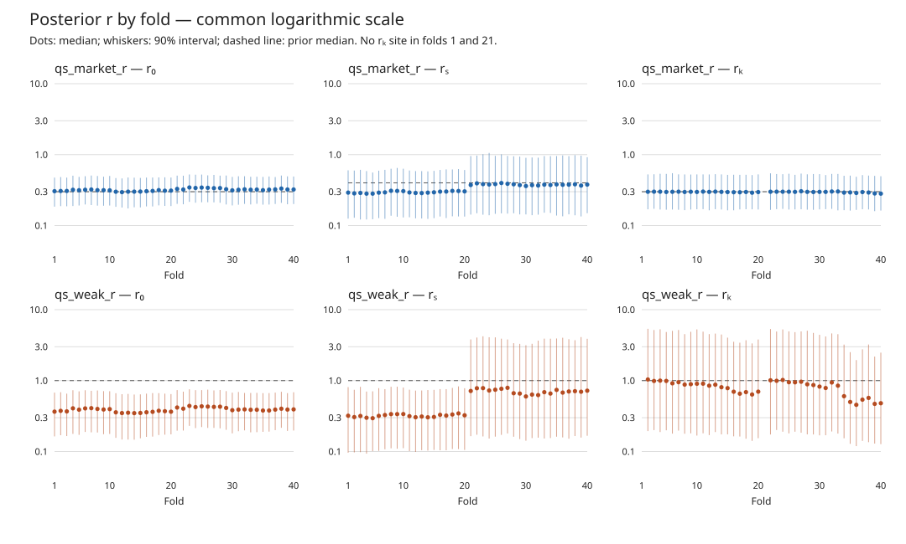

# Quality/style goal model vs market model — report

1. On 40-fold Scottish League One/Two (710 fixtures), neither QS goal arm beats the MultiScaleGRW control on 1X2 LogLoss. Both are slightly worse: qs_market_r +0.00159 and qs_weak_r +0.00107, each "worse" on the prescribed 8-week noncircular block 90% interval.
2. That "worse" call is fragile. Both fixture-clustered 95% intervals and both circular-block 90% intervals cross 0. The noncircular replicates are off-centre by up to 0.0058 (`block_bootstrap_check.csv`).
3. O/U 2.5 LogLoss: both QS arms are a little better than the control (−0.0008, −0.0010), with no detectable difference.
4. The clearest QS gain is supremacy calibration. The compression slope falls from 1.19 (control) to 1.01 (qs_market_r) and 1.05 (qs_weak_r); the market C0 arm is 1.02. The all-market ECE also improves, 0.0204 → 0.0127/0.0134.
5. Goal log score is joint double Poisson = total (Poisson Λ) + allocation (Binomial). Against the control, the QS arms are better on total (−0.0033/−0.0025, intervals touch 0) and worse on allocation (+0.0006/+0.0011; qs_weak_r "worse").
6. Goal data does not move r away from the market prior. In qs_market_r, posterior r₀/rₛ/rₖ medians are 0.32/0.34/0.30, essentially the prior.
7. Under the weak prior (median 1), goals pull r₀ to 0.39 and rₛ to 0.47. rₖ stays at 0.87 with a 90% interval of 0.18–4.6, so goals cannot identify the micro-scale r.
8. The market C0 arm (refitted per fold, pre-week, 128 θ × 4 states) has the best point 1X2 LogLoss (0.61343) and RPS (0.2217). It is within 0.0003 of the de-vigged close (0.61312), and against every goal arm the difference is not detectable.
9. Market C0 has the smallest transition-cohort bias: any-transition, first 20 matches, +0.9 pp vs +3.4 to +4.3 pp for the goal arms.
10. The secondary control control_td is the worst arm on 1X2 (0.62046) and the most compressed (slope 2.78). Every arm against control_td has no detectable difference on the prescribed interval. The exception is market C0 on the circular block, classed "better".
11. Convergence: every goal fold R̂ ≤ 1.0117, so no rerun was triggered. Divergences ≤ 8.1e-5. qs_weak_r's minimum tail ESS is 355, below the engine's 400 review gate. Market C0: 40/40 gates pass, R̂ ≤ 1.0014.
12. Decision: no promotion. A QS rotation buys calibration (decompression) at no detectable LogLoss gain over the GRW control. No ROI or staking was run.

## Runs

| Arm | Model | run_id | Grid h | max R̂ | min ESS bulk/tail | Divergences |
|---|---|---|---:|---:|---|---:|
| control_grw (control) | MultiScaleGRW | `a036d22a-ff32-404c-b801-5f928d8a89f4` | 0.26 | 1.0117 | 650 / 644 | 6 / 160,000 |
| control_td | TimeDecay(180) | `1dccb320-526c-4700-9258-134788a636ef` | 0.03 | 1.0072 | 1079 / 909 | 13 / 160,000 |
| qs_market_r | QualityStyleGRW, market r | `b18ae74b-9bc1-4cfa-b363-a640131adb2d` | 0.27 | 1.0100 | 951 / 1149 | 2 / 160,000 |
| qs_weak_r | QualityStyleGRW, LogNormal(0,1) r | `21f2a9f9-b96f-4034-97de-767704a9d54a` | 0.26 | 1.0092 | 820 / **355** | 0 / 160,000 |
| market_c0 | Phase C C0 on inverted closes, per fold | files (`results/market_grid_summary.csv`) | ~1.6 | 1.0014 | ≥ 5893 bulk | n/a (slice) |

Experiment `scottish_lower_quality_style_2426`; scorecard v1.2, de-vigged Betfair TWA(−20,0]; pinned snapshot SHA256 `c786e2fc…423b4`.

## Target-panel scores (harness, 710 fixtures)

| Arm | LL all | LL 1X2 | LL OU2.5 | LL BTTS | RPS 1X2 | Brier 1X2 | ECE 1X2 | ECE all | Compression | Model-on-market |
|---|---:|---:|---:|---:|---:|---:|---:|---:|---:|---:|
| control_grw | 0.64452 | 0.61678 | 0.68786 | 0.69129 | 0.22499 | 0.21335 | 0.0180 | 0.0204 | 1.192 | 0.373 |
| control_td | 0.64685 | 0.62046 | 0.68983 | 0.68767 | 0.22709 | 0.21498 | 0.0170 | 0.0115 | 2.782 | 0.192 |
| qs_market_r | 0.64520 | 0.61837 | 0.68708 | 0.69054 | 0.22577 | 0.21408 | 0.0211 | 0.0127 | 1.007 | 0.473 |
| qs_weak_r | 0.64472 | 0.61785 | 0.68682 | 0.68980 | 0.22549 | 0.21384 | 0.0187 | 0.0134 | 1.051 | 0.435 |
| market_c0 | 0.64240 | 0.61343 | 0.68859 | 0.68929 | 0.22168 | 0.21167 | 0.0157 | 0.0153 | 1.023 | 0.777 |
| market close | 0.64182 | 0.61312 | 0.68988 | 0.68337 | 0.21110 | 0.21156 | 0.0186 | 0.0139 | — | — |

W1 consistency check (not substituted): `grw_lower_poisson` (`f64a00a2`) all-market LL 0.64460, compression 1.190; refitted `control_grw` 0.64452 / 1.192. `td_lower_poisson` (`de7fa956`) 0.64679 / 2.781; refitted `control_td` 0.64685 / 2.782.

## Paired LogLoss differences (arm − reference; < 0 favours the arm)

Block = 8-week noncircular moving block within season, 999 reps, 90% CI (prescribed, and used for the class). Cluster = harness fixture-clustered paired bootstrap, 95%. `results/paired_logloss.csv` has every family. `results/block_bootstrap_check.csv` adds the circular-block sensitivity.

| Pair | Market | Δ | Block 90% | Cluster 95% | Class |
|---|---|---:|---|---|---|
| qs_market_r − control_grw | 1X2 | +0.00159 | [+0.00042, +0.00369] | [−0.00079, +0.00399] | worse |
| qs_market_r − control_grw | OU2.5 | −0.00078 | [−0.00857, +0.00252] | [−0.00831, +0.00640] | no detectable difference |
| qs_weak_r − control_grw | 1X2 | +0.00107 | [+0.00032, +0.00287] | [−0.00073, +0.00288] | worse |
| qs_weak_r − control_grw | OU2.5 | −0.00104 | [−0.00732, +0.00126] | [−0.00687, +0.00454] | no detectable difference |
| control_grw − control_td | 1X2 | −0.00368 | [−0.00715, +0.00103] | [−0.00870, +0.00123] | no detectable difference |
| qs_market_r − control_td | 1X2 | −0.00209 | [−0.00654, +0.00421] | [−0.00857, +0.00420] | no detectable difference |
| qs_weak_r − control_td | 1X2 | −0.00261 | [−0.00656, +0.00349] | [−0.00864, +0.00328] | no detectable difference |
| market_c0 − control_grw (best goal arm) | 1X2 | −0.00335 | [−0.00702, +0.00434] | [−0.01271, +0.00616] | no detectable difference |
| market_c0 − control_grw | OU2.5 | +0.00073 | [−0.01225, +0.00520] | [−0.01276, +0.01358] | no detectable difference |
| market_c0 − control_td | 1X2 | −0.00703 | [−0.01041, +0.00187] | [−0.01689, +0.00293] | no detectable difference |
| control_grw − market close | 1X2 | +0.00367 | [−0.00595, +0.00578] | [−0.00638, +0.01363] | no detectable difference |
| qs_market_r − market close | 1X2 | +0.00525 | [−0.00477, +0.00858] | [−0.00442, +0.01488] | no detectable difference |
| qs_weak_r − market close | 1X2 | +0.00473 | [−0.00496, +0.00784] | [−0.00506, +0.01448] | no detectable difference |
| market_c0 − market close | 1X2 | +0.00032 | [−0.00553, +0.00195] | [−0.00597, +0.00650] | no detectable difference |

**Block-bootstrap caveat.** The noncircular scheme (as in research R07) under-samples the first and last weeks of each season. Here its replicate mean departs from the point estimate by up to 0.0058, for example qs_market_r 1X2: point +0.00159 but replicate mean +0.00205. A circular-block sensitivity centres within 0.0008, and on it both primary 1X2 rows become "no detectable difference" ([−0.00001, +0.00329] and [−0.00023, +0.00246]). Market C0 − control_td 1X2 becomes "better". The prescribed class is reported above and left unchanged.

## Goal log score (negative, arm − reference; < 0 favours the arm; block 90%)

| Pair | Joint | Total (Poisson Λ) | Allocation (Binomial) |
|---|---|---|---|
| qs_market_r − control_grw | −0.00272 [−0.00839, +0.00178] | −0.00332 [−0.00967, +0.00030] | +0.00059 [−0.00149, +0.00369] |
| qs_weak_r − control_grw | −0.00138 [−0.00531, +0.00255] | −0.00250 [−0.00734, +0.00033] | +0.00112 [+0.00015, +0.00367] worse |
| market_c0 − control_grw | +0.00835 [−0.01148, +0.02332] | +0.01096 [−0.00615, +0.01828] | −0.00262 [−0.01177, +0.00965] |
| market_c0 − control_td | +0.00031 [−0.01758, +0.02000] | +0.01187 [+0.00081, +0.01928] worse | −0.01156 [−0.02208, +0.00436] |

Posterior-mixture scores over each arm's own draws, as in R07: 4,000 draws per goal arm and 512 for the market arm. Market C0 is a model of market rates, not goals, so its total-goal channel is the weakest.

## Posterior r by fold (median over folds of per-fold posterior medians)

| Arm | r₀ | rₛ | rₖ (38 folds with target steps) | Implied ρ(Δα, Δβ) at median rₖ |
|---|---|---|---|---|
| qs_market_r (prior medians 0.30 / 0.40 / 0.30) | 0.319 (0.296–0.344) | 0.335 (0.282–0.397) | 0.298 (0.282–0.304) | −0.84 |
| qs_weak_r (prior medians 1 / 1 / 1) | 0.390 (0.348–0.440) | 0.471 (0.295–0.791) | 0.870 (0.455–1.037); per-fold 90% ≈ [0.18, 4.6] | −0.14 |

Ranges are across folds. Per-fold rows: `results/posterior_r_by_fold.csv`.

Whiskers are per-fold posterior 90% intervals; dashed lines are prior medians. All panels use
the same logarithmic scale. Folds 1 and 21 have no sampled micro-scale ratio, so no rₖ point is shown.

## Files

`results/RUNS.csv`, `harness_scores_vs_control_grw.csv` (full harness scorecard incl. subsets and transition cohorts), `paired_logloss.csv`, `paired_goal_logscore.csv`, `block_bootstrap_check.csv`, `posterior_r_by_fold.csv`, `market_grid_summary.csv`. Beast outputs: `/root/BF_runs/qs_experiment_out/`. Logs: `/root/BF_runs/logs/qs_experiment/`.
