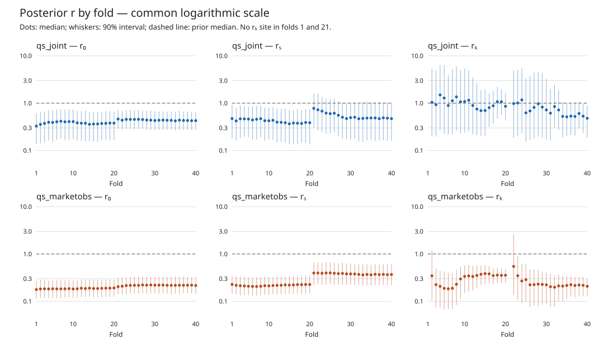

# Wave 2 — joint goals+xG and market-rate observations

1. All four frozen 40-fold grids forecast the same 710 Scottish L1/L2 fixtures; no reference refits or tuning.
2. Primary A: QS joint − GRW joint 1X2 LogLoss −0.000192; prescribed noncircular 90% interval crosses zero.
3. Primary B: GRW/QS market-observation point LogLoss 0.611754/0.611917 versus saved C0 0.613434 and GRW joint 0.616372; all primary noncircular 1X2 intervals cross zero.
4. Circular intervals classify both market arms against GRW joint as better, contradicting the prescribed no-difference class. Noncircular centring drift reaches 0.004564; do not substitute the circular decision.
5. QS joint compression is 1.167 versus GRW joint 1.239; market arms 1.097/1.070 versus C0 1.023. These are calibration diagnostics, not evidence of a LogLoss win.
6. Joint weak-r median r₀/rₛ/rₖ over folds is 0.419/0.471/0.853; micro r remains broad (median per-fold 90% bounds 0.216–3.314).
7. Market QS median r₀/rₛ/rₖ is 0.197/0.295/0.228. Micro intervals exclude prior median 1 in 36/38 folds and include 0.3 in all 38: substantially informed, not uniformly identified.
8. Market σ_obs medians are 0.1198/0.1192 versus saved C0 0.0639, with the same HalfNormal(0.20) prior but different state/time-clock formulations.
9. All grids have zero divergences and Rhat≤1.01721; retain GRW joint tail ESS324.47 and GRW market tail339.34/bulk395.44 review flags. No extra sampling authorised.
10. Decision: no promotion on the prescribed primary intervals. All references match saved wave1 scores exactly; no ROI/staking. Phase5 reproduction is recorded separately.

## Fixed panel, score law and traceability

Namespace `scottish_lower_qs_wave2_2426`, scorecard **v1.2**, de-vigged Betfair TWA(−20,0]. Frozen snapshot `c786e2fc…423b4`; exact full hashes in PROGRESS.md. Runs: `results/phase3/RUNS.csv`, including original sampling source; all4×40 folds, 4×(500+1000), attempt0, no Rhat reruns. Full diagnostics/hard gates: PHASE3.md and committed phase3 CSVs.

All arms forecast710 fixtures; quoted common panels: 1X2 **595 fixtures/1785 selections**, OU2.5 **379/758**, BTTS **178/356**, all **627/2899**. Harness LogLoss is selection-level binary LogLoss, not summed categorical match loss. No arm-specific subset. Goal scores use all710 fixtures. Each report table is a view of named committed CSVs under `results/phase4/`; underlying observation and goal-fixture rows are also committed.

## Outcome scores and slopes

`headline.csv`, derived from `harness_scores_vs_grw_joint.csv`. Reference rows are reused verbatim in `wave1_reference_scores.csv`; independent metrics match exactly (`reference_score_parity.csv`); all1992 reused reference rows are also byte-identical to the corresponding committed wave1 CSV lines (`reference_csv_byte_parity.csv`).

|     model     |  ll_1x2  | ll_ou25  | ll_btts  |   rps    |  brier   | ece_1x2 | ece_all | compression_slope | model_on_market_slope |
|---------------|---------:|---------:|---------:|---------:|---------:|--------:|--------:|------------------:|----------------------:|
| grw_marketobs | 0.611754 | 0.686629 | 0.685945 | 0.220822 | 0.210987 | 0.03123 | 0.02951 | 1.097             | 0.689                 |
| qs_marketobs  | 0.611917 | 0.686544 | 0.688133 | 0.220974 | 0.211061 | 0.01884 | 0.00911 | 1.07              | 0.722                 |
| market_close  | 0.613118 | 0.689878 | 0.683371 | 0.211104 | 0.211564 | 0.01858 | 0.01391 | NULL              | NULL                  |
| market_c0     | 0.613434 | 0.68859  | 0.689292 | 0.221679 | 0.211665 | 0.01574 | 0.01528 | 1.023             | 0.777                 |
| qs_joint      | 0.61618  | 0.690041 | 0.682    | 0.224097 | 0.213111 | 0.02661 | 0.02355 | 1.167             | 0.578                 |
| grw_joint     | 0.616372 | 0.690005 | 0.681137 | 0.224365 | 0.213204 | 0.01243 | 0.01214 | 1.239             | 0.542                 |
| control_grw   | 0.616783 | 0.687864 | 0.691295 | 0.224987 | 0.213354 | 0.01797 | 0.02035 | 1.192             | 0.373                 |
| qs_weak_r     | 0.617849 | 0.686823 | 0.6898   | 0.225489 | 0.213838 | 0.01872 | 0.01341 | 1.051             | 0.435                 |

## All prescribed paired outcome comparisons

Loss orientation arm−reference; negative favours the arm. Prescribed noncircular8-week blocks:999 reps, within season, seed20261009,90% CI. Circular sensitivity uses the same block length/budget/seed. Harness fixture-clustered bootstrap:10000 reps,seed20260911,95% CI. Classification uses **only noncircular90%**; `contradiction` flags any circular change, including detectable versus undetectable. BTTS/all full rows are in `paired_intervals.csv`; 1X2/OU shown below.

|   tier    |      arm      |   reference   | market |   delta   |         nc90          |       cluster95       |      circular90       |     prescribed_class     | contradiction |
|-----------|---------------|---------------|--------|----------:|-----------------------|-----------------------|-----------------------|--------------------------|---------------|
| primary_A | qs_joint      | grw_joint     | 1X2    | -0.000192 | [-0.000821, 0.000529] | [-0.001527, 0.001174] | [-0.00085, 0.000504]  | no detectable difference | false         |
| primary_A | qs_joint      | grw_joint     | OU2.5  | 3.6e-05   | [-0.003002, 0.001759] | [-0.003477, 0.00338]  | [-0.002426, 0.002166] | no detectable difference | false         |
| primary_B | grw_marketobs | grw_joint     | 1X2    | -0.004618 | [-0.006303, 0.000595] | [-0.011201, 0.002002] | [-0.007997, -0.00083] | no detectable difference | true          |
| primary_B | grw_marketobs | grw_joint     | OU2.5  | -0.003376 | [-0.009231, 0.005893] | [-0.016767, 0.009856] | [-0.010522, 0.004294] | no detectable difference | false         |
| primary_B | grw_marketobs | market_c0     | 1X2    | -0.00168  | [-0.003732, 0.000167] | [-0.005365, 0.002105] | [-0.003564, 0.000404] | no detectable difference | false         |
| primary_B | grw_marketobs | market_c0     | OU2.5  | -0.001961 | [-0.002237, 0.000651] | [-0.005345, 0.0013]   | [-0.00409, 0.000158]  | no detectable difference | false         |
| primary_B | qs_marketobs  | grw_joint     | 1X2    | -0.004455 | [-0.006048, 0.00112]  | [-0.011338, 0.002429] | [-0.008361, -0.00026] | no detectable difference | true          |
| primary_B | qs_marketobs  | grw_joint     | OU2.5  | -0.003461 | [-0.009218, 0.006739] | [-0.016688, 0.009461] | [-0.011205, 0.004564] | no detectable difference | false         |
| primary_B | qs_marketobs  | market_c0     | 1X2    | -0.001517 | [-0.002938, 2.6e-05]  | [-0.004604, 0.00162]  | [-0.002878, 1e-05]    | no detectable difference | false         |
| primary_B | qs_marketobs  | market_c0     | OU2.5  | -0.002046 | [-0.003298, 0.002879] | [-0.006055, 0.001964] | [-0.00532, 0.001495]  | no detectable difference | false         |
| secondary | grw_joint     | control_grw   | 1X2    | -0.000412 | [-0.004154, 0.003623] | [-0.006286, 0.005396] | [-0.004083, 0.003502] | no detectable difference | false         |
| secondary | grw_joint     | control_grw   | OU2.5  | 0.002141  | [-0.010173, 0.006414] | [-0.008662, 0.012896] | [-0.006974, 0.010177] | no detectable difference | false         |
| secondary | grw_joint     | market_close  | 1X2    | 0.003254  | [-0.005047, 0.004107] | [-0.005159, 0.011663] | [-0.002754, 0.008913] | no detectable difference | false         |
| secondary | grw_joint     | market_close  | OU2.5  | 0.000127  | [-0.005886, 0.009346] | [-0.013147, 0.01333]  | [-0.007853, 0.008477] | no detectable difference | false         |
| secondary | grw_joint     | qs_weak_r     | 1X2    | -0.001477 | [-0.006115, 0.002752] | [-0.007452, 0.004399] | [-0.005732, 0.002981] | no detectable difference | false         |
| secondary | grw_joint     | qs_weak_r     | OU2.5  | 0.003182  | [-0.005765, 0.007583] | [-0.007321, 0.014]    | [-0.003608, 0.009207] | no detectable difference | false         |
| secondary | grw_marketobs | market_close  | 1X2    | -0.001364 | [-0.007383, 0.000391] | [-0.008312, 0.005366] | [-0.005853, 0.002712] | no detectable difference | false         |
| secondary | grw_marketobs | market_close  | OU2.5  | -0.003249 | [-0.00412, 0.003622]  | [-0.011228, 0.004663] | [-0.007829, 0.001991] | no detectable difference | false         |
| secondary | qs_joint      | control_grw   | 1X2    | -0.000604 | [-0.004321, 0.00338]  | [-0.006856, 0.005537] | [-0.004171, 0.00314]  | no detectable difference | false         |
| secondary | qs_joint      | control_grw   | OU2.5  | 0.002177  | [-0.010795, 0.006383] | [-0.008104, 0.012509] | [-0.007455, 0.0104]   | no detectable difference | false         |
| secondary | qs_joint      | market_close  | 1X2    | 0.003062  | [-0.005336, 0.004216] | [-0.005179, 0.011247] | [-0.003054, 0.008524] | no detectable difference | false         |
| secondary | qs_joint      | market_close  | OU2.5  | 0.000163  | [-0.005065, 0.007611] | [-0.011369, 0.011677] | [-0.006579, 0.007294] | no detectable difference | false         |
| secondary | qs_joint      | qs_weak_r     | 1X2    | -0.001669 | [-0.00626, 0.002428]  | [-0.0078, 0.004371]   | [-0.005741, 0.002726] | no detectable difference | false         |
| secondary | qs_joint      | qs_weak_r     | OU2.5  | 0.003218  | [-0.005547, 0.006247] | [-0.005718, 0.012374] | [-0.003119, 0.008323] | no detectable difference | false         |
| secondary | qs_marketobs  | grw_marketobs | 1X2    | 0.000163  | [-0.000485, 0.001296] | [-0.001035, 0.001361] | [-0.000791, 0.001215] | no detectable difference | false         |
| secondary | qs_marketobs  | grw_marketobs | OU2.5  | -8.5e-05  | [-0.001803, 0.002847] | [-0.003451, 0.00329]  | [-0.002218, 0.002251] | no detectable difference | false         |
| secondary | qs_marketobs  | market_close  | 1X2    | -0.001201 | [-0.006928, 0.000789] | [-0.007875, 0.005342] | [-0.005498, 0.002808] | no detectable difference | false         |
| secondary | qs_marketobs  | market_close  | OU2.5  | -0.003334 | [-0.005179, 0.005697] | [-0.011615, 0.004772] | [-0.009034, 0.003315] | no detectable difference | false         |

All circular contradictions (including BTTS):

|      arm      | reference | market |     prescribed_class     | circular_class |
|---------------|-----------|--------|--------------------------|----------------|
| grw_marketobs | grw_joint | 1X2    | no detectable difference | better         |
| qs_marketobs  | grw_joint | 1X2    | no detectable difference | better         |
| qs_joint      | qs_weak_r | BTTS   | no detectable difference | better         |

## Goal total/allocation scores

Posterior-mixture joint double-Poisson score, log-mean-exp over4000 draws for new arms and saved Poisson references,512 for C0. Total is the mixture Poisson(λh+λa) score; allocation is joint−total, the implied conditional allocation score, not a separately averaged Binomial mixture. Negative-score differences use all710 fixtures. `goal_intervals.csv` joins `paired_goal_logscore.csv` and `goal_circular_sensitivity.csv`. Standalone unchanged wave1 r05_goal_cluster confirms all30 harness point estimates and byte-identical interval CSV. Exact saved fixture-reference parity: `reference_goal_parity.csv` / `wave1_reference_goal_fixtures.csv`. Close goal-score pairs are undefined for710:193 have no invertible book, so none are estimated on a smaller favourable subset.

|   tier    |      arm      |   reference   |  channel   |   delta   |          nc90          |       cluster95        |       circular90       |     prescribed_class     | contradiction |
|-----------|---------------|---------------|------------|----------:|------------------------|------------------------|------------------------|--------------------------|---------------|
| primary_A | qs_joint      | grw_joint     | allocation | -0.002354 | [-0.004134, -0.000682] | [-0.005153, 0.000374]  | [-0.004199, -0.000747] | better                   | false         |
| primary_A | qs_joint      | grw_joint     | joint      | -0.002412 | [-0.005605, 0.000358]  | [-0.006333, 0.001458]  | [-0.005171, 3.8e-05]   | no detectable difference | false         |
| primary_A | qs_joint      | grw_joint     | total      | -5.8e-05  | [-0.002742, 0.002055]  | [-0.003029, 0.003006]  | [-0.002595, 0.001908]  | no detectable difference | false         |
| primary_B | grw_marketobs | grw_joint     | allocation | -0.00643  | [-0.010489, 0.005084]  | [-0.020012, 0.006815]  | [-0.014292, 0.002482]  | no detectable difference | false         |
| primary_B | grw_marketobs | grw_joint     | joint      | -0.00497  | [-0.011851, 0.011649]  | [-0.022955, 0.012195]  | [-0.017484, 0.008071]  | no detectable difference | false         |
| primary_B | grw_marketobs | grw_joint     | total      | 0.00146   | [-0.007118, 0.01161]   | [-0.009789, 0.013306]  | [-0.007615, 0.009732]  | no detectable difference | false         |
| primary_B | grw_marketobs | market_c0     | allocation | -0.0009   | [-0.004504, 0.007467]  | [-0.011076, 0.01058]   | [-0.006864, 0.005593]  | no detectable difference | false         |
| primary_B | grw_marketobs | market_c0     | joint      | -0.012559 | [-0.015982, 0.000104]  | [-0.024055, 0.000151]  | [-0.020308, -0.003619] | no detectable difference | true          |
| primary_B | grw_marketobs | market_c0     | total      | -0.011659 | [-0.013304, -0.005794] | [-0.01615, -0.007292]  | [-0.015496, -0.007405] | better                   | false         |
| primary_B | qs_marketobs  | grw_joint     | allocation | -0.007402 | [-0.011995, 0.004317]  | [-0.021673, 0.006108]  | [-0.015708, 0.001799]  | no detectable difference | false         |
| primary_B | qs_marketobs  | grw_joint     | joint      | -0.006646 | [-0.013111, 0.009199]  | [-0.025418, 0.011282]  | [-0.018972, 0.005544]  | no detectable difference | false         |
| primary_B | qs_marketobs  | grw_joint     | total      | 0.000755  | [-0.007912, 0.010803]  | [-0.010715, 0.012642]  | [-0.008062, 0.008927]  | no detectable difference | false         |
| primary_B | qs_marketobs  | market_c0     | allocation | -0.001871 | [-0.003765, 0.004129]  | [-0.009728, 0.006748]  | [-0.006027, 0.002637]  | no detectable difference | false         |
| primary_B | qs_marketobs  | market_c0     | joint      | -0.014235 | [-0.015983, -0.003883] | [-0.023961, -0.004147] | [-0.020432, -0.006934] | better                   | false         |
| primary_B | qs_marketobs  | market_c0     | total      | -0.012364 | [-0.014044, -0.006239] | [-0.017808, -0.007163] | [-0.016293, -0.007903] | better                   | false         |
| secondary | grw_joint     | control_grw   | allocation | 0.002915  | [-0.002859, 0.009555]  | [-0.008375, 0.014456]  | [-0.003317, 0.009174]  | no detectable difference | false         |
| secondary | grw_joint     | control_grw   | joint      | 0.000759  | [-0.010413, 0.005903]  | [-0.014283, 0.015681]  | [-0.008238, 0.009525]  | no detectable difference | false         |
| secondary | grw_joint     | control_grw   | total      | -0.002156 | [-0.00956, -0.001281]  | [-0.01131, 0.007086]   | [-0.007538, 0.003122]  | better                   | true          |
| secondary | grw_joint     | qs_weak_r     | allocation | 0.001798  | [-0.005085, 0.007942]  | [-0.01005, 0.014139]   | [-0.005225, 0.00844]   | no detectable difference | false         |
| secondary | grw_joint     | qs_weak_r     | joint      | 0.002138  | [-0.00865, 0.007484]   | [-0.013351, 0.01783]   | [-0.0065, 0.010775]    | no detectable difference | false         |
| secondary | grw_joint     | qs_weak_r     | total      | 0.00034   | [-0.007104, 0.002912]  | [-0.008828, 0.009503]  | [-0.004963, 0.005769]  | no detectable difference | false         |
| secondary | qs_joint      | control_grw   | allocation | 0.000561  | [-0.005662, 0.007339]  | [-0.01123, 0.012377]   | [-0.005604, 0.007138]  | no detectable difference | false         |
| secondary | qs_joint      | control_grw   | joint      | -0.001653 | [-0.01376, 0.004216]   | [-0.016351, 0.012846]  | [-0.011047, 0.00761]   | no detectable difference | false         |
| secondary | qs_joint      | control_grw   | total      | -0.002214 | [-0.01014, -0.001087]  | [-0.010808, 0.006291]  | [-0.007809, 0.002497]  | better                   | true          |
| secondary | qs_joint      | qs_weak_r     | allocation | -0.000556 | [-0.007346, 0.005424]  | [-0.012554, 0.011847]  | [-0.007329, 0.00635]   | no detectable difference | false         |
| secondary | qs_joint      | qs_weak_r     | joint      | -0.000274 | [-0.01074, 0.004318]   | [-0.014837, 0.01452]   | [-0.008656, 0.007996]  | no detectable difference | false         |
| secondary | qs_joint      | qs_weak_r     | total      | 0.000282  | [-0.005751, 0.001131]  | [-0.007138, 0.007856]  | [-0.003921, 0.004413]  | no detectable difference | false         |
| secondary | qs_marketobs  | grw_marketobs | allocation | -0.000971 | [-0.003696, 0.001131]  | [-0.004637, 0.002331]  | [-0.003525, 0.001474]  | no detectable difference | false         |
| secondary | qs_marketobs  | grw_marketobs | joint      | -0.001676 | [-0.005313, 0.001376]  | [-0.006503, 0.002856]  | [-0.004882, 0.001506]  | no detectable difference | false         |
| secondary | qs_marketobs  | grw_marketobs | total      | -0.000705 | [-0.002873, 0.001367]  | [-0.003507, 0.002145]  | [-0.002516, 0.001177]  | no detectable difference | false         |

## Transition-cohort bias

Transitioning-club model−close win probability in percentage points; positive means overrated. Harness club-season-clustered95% intervals; first20 fixtures. The full first10/20 and directional cohorts, including zero-size relegated rows, are retained in the harness CSV. Counts below are common quoted fixtures, not all forecast fixtures.

|     model     |               subset                | n_fixtures | bias_pp |      ci95       |
|---------------|-------------------------------------|-----------:|--------:|-----------------|
| control_grw   | transition_any_first20              | 132        | 4.333   | [1.213, 8.133]  |
| grw_joint     | transition_any_first20              | 132        | 3.868   | [2.1, 5.724]    |
| grw_marketobs | transition_any_first20              | 132        | 1.847   | [0.407, 3.411]  |
| market_c0     | transition_any_first20              | 132        | 0.933   | [-0.427, 2.32]  |
| qs_joint      | transition_any_first20              | 132        | 3.506   | [1.723, 5.31]   |
| qs_marketobs  | transition_any_first20              | 132        | 1.565   | [0.313, 2.898]  |
| qs_weak_r     | transition_any_first20              | 132        | 3.661   | [0.66, 7.28]    |
| control_grw   | transition_promoted_into_L1_first20 | 71         | 1.841   | [0.282, 3.401]  |
| grw_joint     | transition_promoted_into_L1_first20 | 71         | 4.125   | [2.67, 6.425]   |
| grw_marketobs | transition_promoted_into_L1_first20 | 71         | 1.591   | [0.946, 2.374]  |
| market_c0     | transition_promoted_into_L1_first20 | 71         | 0.694   | [-1.117, 2.063] |
| qs_joint      | transition_promoted_into_L1_first20 | 71         | 3.611   | [1.956, 5.424]  |
| qs_marketobs  | transition_promoted_into_L1_first20 | 71         | 1.435   | [0.896, 2.264]  |
| qs_weak_r     | transition_promoted_into_L1_first20 | 71         | 0.734   | [-1.01, 2.793]  |

Entered-SPFL first20 cohort (`transition_entered_spfl_first20`):

| model | n_fixtures | bias_pp | ci95 |
|---|---:|---:|---|
| control_grw | 69 | -3.255 | [-8.658, 4.749] |
| grw_joint | 69 | -2.499 | [-7.802, 2.549] |
| grw_marketobs | 69 | 1.070 | [-0.377, 2.916] |
| market_c0 | 69 | 1.235 | [0.010, 2.119] |
| qs_joint | 69 | -1.963 | [-7.581, 3.366] |
| qs_marketobs | 69 | 1.394 | [-0.027, 3.190] |
| qs_weak_r | 69 | -1.920 | [-7.982, 7.408] |

## Posterior ratios and measurement noise

`r_summary.csv` aggregates `posterior_r_by_fold.csv` (236rows). Each summary bound is the median of **per-fold**90% quantiles, not a pooled posterior interval. rₖ is absent in folds1/21 (no micro steps), not imputed. Weak prior LogNormal(0,1) is unchanged. Market rₖ is compatible with Kalman≈0.3, with substantially reduced uncertainty; two folds remain broad, so do not claim uniform identification.

|     arm      | scale | folds | excludes_prior_median | covers_0_3 | median_r | min_median | max_median | median_q05 | median_q95 |
|--------------|-------|------:|----------------------:|-----------:|---------:|-----------:|-----------:|-----------:|-----------:|
| qs_joint     | r₀    | 40    | 40                    | 40         | 0.419    | 0.328      | 0.462      | 0.222      | 0.683      |
| qs_joint     | rₖ    | 38    | 5                     | 32         | 0.853    | 0.48       | 1.494      | 0.216      | 3.314      |
| qs_joint     | rₛ    | 40    | 23                    | 39         | 0.471    | 0.366      | 0.777      | 0.167      | 0.957      |
| qs_marketobs | r₀    | 40    | 40                    | 20         | 0.197    | 0.177      | 0.221      | 0.132      | 0.3        |
| qs_marketobs | rₖ    | 38    | 36                    | 38         | 0.228    | 0.184      | 0.546      | 0.108      | 0.471      |
| qs_marketobs | rₛ    | 40    | 40                    | 40         | 0.295    | 0.205      | 0.398      | 0.181      | 0.469      |

`sigma_summary.csv` aggregates all40fold full retained σ_obs draws, C0 from exp(first saved parameter) without fitting. Distinct biweekly builder versus weekly Kalman dynamics means σ_obs is not directly interchangeable.

|      arm      | folds | median_sigma | median_q05 | median_q95 |
|---------------|------:|-------------:|-----------:|-----------:|
| grw_marketobs | 40    | 0.11982      | 0.11585    | 0.12404    |
| market_c0     | 40    | 0.06385      | 0.06034    | 0.06762    |
| qs_marketobs  | 40    | 0.11924      | 0.11526    | 0.12338    |

## Acceptance and execution

Phase4 source: manager-authorised one-parenthesis correction only; failed v1 preserved in `results/phase4_v1/` and `results/gate_logs/phase4_score_v1.log`. Fresh v2 scorer and supplementary interval audit PASS. Original wave1 standalone block/goal-cluster paths unchanged; all new-arm fits are saved UUID loads, no scoring DB writes. Exact reference parity, common panels and every required pair checked. Read-only wave1 producer/source discrepancy is documented in DECISIONS_LOG.md and TODO041 as a separate follow-up; no wave1 edits. Phase5: all four fresh frozen-seed fold1 reproductions passed raw-byte chain/latent equality with maxdiff0; all160 original checkpoint digests unchanged. See [REPRODUCIBILITY.md](REPRODUCIBILITY.md).
